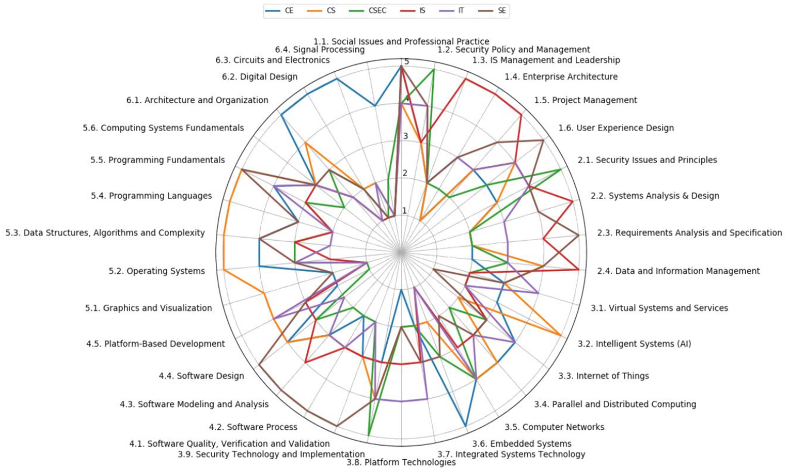
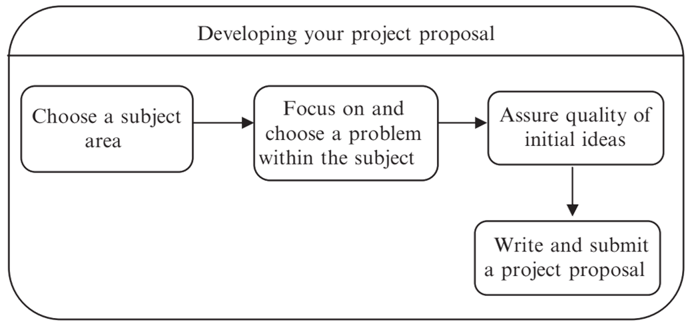
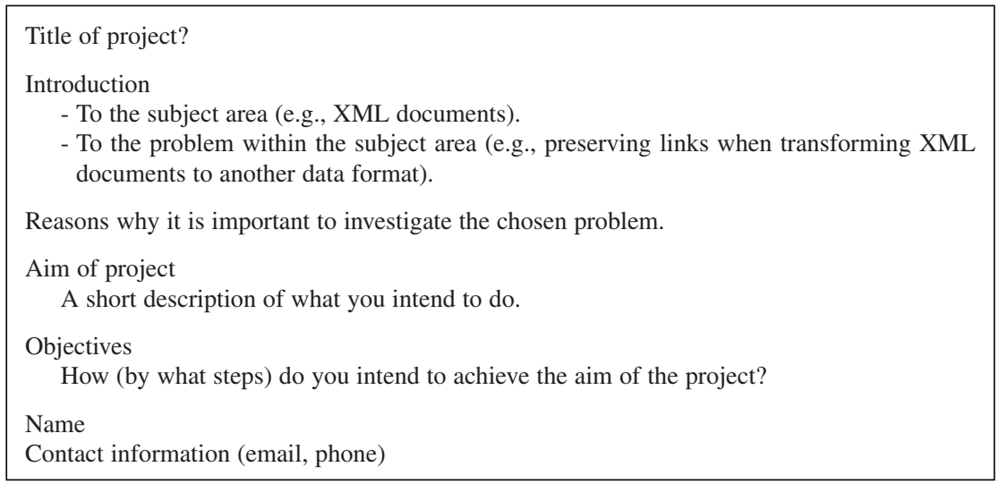

Pilih bidang apa yang mau diteliti, misalnya:

- Database systems
- Electronic commerce
- Software engineering
- Human-computer interaction. Multimedia, game, ARVR

> Informatika ada di Computer Science

### Start Early

> Lebih mudah untuk mencari masalah baru menentukan subjek area ketimbang memilih subjek area dulu baru mencari masalah.

Lebih banyak waktu yang bisa dimanfaatkan jika mulai lebih dulu. Ada banyak sumber informasi selain buku seperti prosiding atau jurnal.

Jika tidak ketemu literatur untuk projeknya, kemungkinan bisa:

- Pilihan subject area terlalu baru untuk S1 atau S2
- Salah tempat mencari, misal seharusnya computer science tapi nyarinya di information system

### How to Choose a Subject Area

**Mahasiswa tertariknya dimana**. Tapi belum tentu juga bisa selesai, kemungkinan topiknya susah. Ketika memilih subject area pastinya *skill yang dibutuhkan*. Kombinasi bidang biasanya bagus tapi jangan lebih dari dua bidang.

> Tambahan: ambil topik dari mata kuliah yang menurut anda menarik. Dan setelah lulus nanti (baca: kerja) apakah mengarah ke topik tersebut.

### Choose Problem to Focus on Within the Subject Area

- Tanyakan kepada diri sendiri, apa yang mau dibuat
- Baca literatur
- Tanya calon dosen pembimbing
- Tanya perusahaan/dinas/organisasi, mungkin mereka punya data, expert, dan masalah
- Jangan sampai mengambil area dimana mata kuliah tidak lulus
- Jika sudah ketemu masalah, apakah bisa di eksplor lebih jauh di masa depan

Jika ada "konsep" atau "design" biasanya deskriptif atau teori. Jika ada produknya biasanya terapan. Mengukur performa biasanya teori, terapan, dan deskriptif.

## Assure Quality of Initial Ideas

Supervisor akan menilai sambil tanya tanya ke student paham gak sama topik yang diambil.

## Write and Submit a Project Proposal

Kalau sudah matang, silahkan mulai menulis proposal. Tulis aja sederhana dulu supaya cepat mulai. Supervisor dan examiner pasti akan melihat proposal dari student.

> Setelah di tulis, review sendiri, minta teman/keluarga untuk review, barulah review dari dosen.

### Struktur

- Pertama, kenalkan subject area yang dipilih ke pembaca.
> pembaca yang dimaksud adalah supervisor lalu examiner
- Kedua, fokus pada interest pada subject area pada problem yang spesifik. Jangan luas luas, bisa jadi celah dosen untuk ditanya.
- Mulai membangun argumen yang bisa mendukung tujuan
- **Tujuan dari proposal penelitian adalah meyakinkan supervisor dan examiner bahwa project layak dilakukan**

> Di proposal, jika tidak *merancang algoritma (baru)* **jangan** masukin Perancangan Algoritma
> Jika tidak *merancang tampilan* **jangan** masukin Perancangan Tampilan