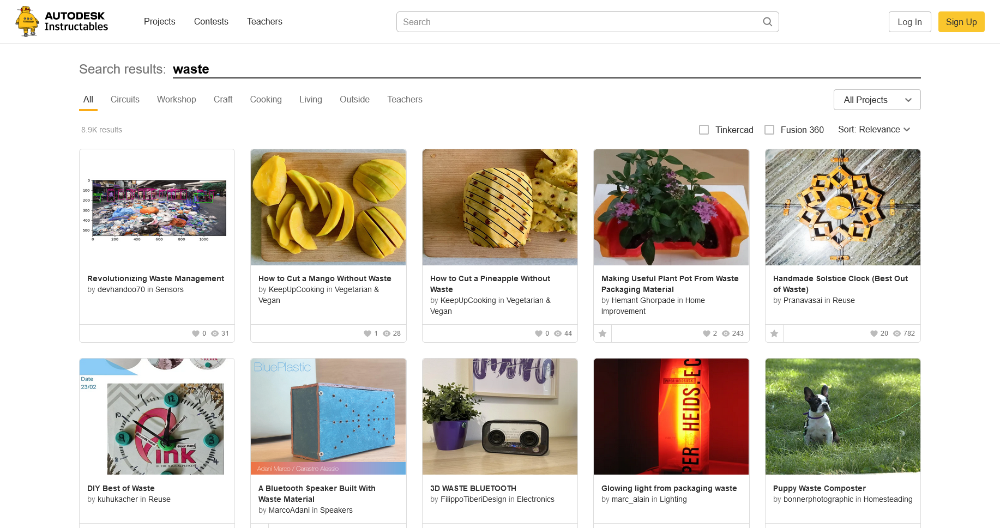

TL;DR. Built an AI-powered waste detection system for EcoCrafters app in one month, creating a model to identify 7 waste types from images. Developed end-to-end ML pipeline using TensorFlow Object Detection API, processed 6000+ annotated images, and deployed via Cloud Run. Achieved 42% mAP score, doubling baseline performance, and successfully deployed real-time detection serving Android users.

<iframe src="https://ecocrafters.fly.dev/" width="100%" height="600" frameborder="0"></iframe>

# Introduction

This project was built for Bangkit Academy Batch 1 2023 Capstone project. The waste detection was integrated with an
Android application to provide any available crafting guides out of captured waste. The backend of this whole flow is
managed in the cloud. I have the chance to work with five other amazing friends with their respective expertise as
Bangkit students. Three students for machine learning part, including me, 2 for cloud computing, and 1 for mobile
development. Together we built this project named EcoCrafters. Have a look at EcoCrafters' GitHub
profile [here](https://github.com/ecoCrafters).

# Data Collection

## Annotated Waste Image Data

First, why do we need the object detection algorithm?
We need the app to be able to get multiple waste from images.
Sure, we can use the multilabel classification, but we decided to use it as a fallback if the object detection didn't
work as expected.

The object detection model needs annotated image data.
By annotated, I mean it has a bounding box around the object.
So after a little research, we found the [TACO dataset](https://tacodataset.org/),
a growing image dataset containing 1500 images with 4784 annotations and 60 categories as of this writing.
We also found the [Drinking Waste Classification Dataset on Kaggle](https://www.kaggle.com/datasets/arkadiyhacks/drinking-waste-classification),
which contains 4828 with 1 annotation in each image corresponding to one of 4 categories.

> Although the dummy data collection has nothing to do with waste detection, I still include it in the section below
> because it also involves fun decision-making situations. You can skip to the data [preprocessing](#data-preprocessing)
> section.

## Dummy Data

I pick the [instructables.com](https://www.instructables.com/) website as the source for the dummy tutorial data.
Instructables provide a wide range of instructions, including building something from waste.
So I build a [web scraping script](https://github.com/ecoCrafters/instructables-scraping) with Python and Selenium
to scrape the Instructables search result content with keyword "waste".



From this page, I scrape the title, thumbnail image, and text content, curate it, and save it to CSV with column name
that matches the database, which our team discussed before. But there is a problem. I need to extract all the material
used in the text content for the database. Some content explicitly lists the material, some put it in the requirement
section, and some don't.

For this type of problem, I might use Named Entity Recognition (NER) to identify all the material in text content, or at
least that's what came to my mind. But that alone needs dedicated time and can be considered a major feature while our
time to build the project is only one month. So instead, I use ChatGPT. Not ChatGPT API because I wouldn't use my money
for this dummy data, but the ChatGPT web interface, so the scraping still needs human interaction.

So I write the script like this. Every time the script scrapes one piece of content, copy the text content with some
prompt (that asks lists the material) to the clipboard, create a temporary text file, open it with Notepad, and halt
execution. This is where human interaction plays a role. With the copied text content on my clipboard, paste it to
ChatGPT chat, wait for the response, copy the response to the Notepad, save it, and the script continues. The script
will parse the copied text to individual material for the database table. Repeat for the next content.

# Data Preprocessing

Initially, we didn't plan to preprocess the data. However, we encountered some issues while running the model training
due to its resource intensity. Even the free version of colab couldn't handle it. Therefore, this is what I did.

## Selecting Data

This is the count of annotations in the TACO dataset.


We select the data with the following criteria:

- Label with annotations that are above 200. As mentioned in
  the [article](https://changsin.medium.com/how-many-images-do-you-need-for-object-detection-d33185629843), the minimal
  amount of image data needed for training is approximately 150-500.
- Remove "Unlabeled litter" and "Cigarette" annotations because they are irrelevant for our app.
- Also, discard the "Other" label as it is too broad for the model to recognize. But let's use the label "Other plastic
  bottle" since we'll be combining it with another dataset source
- Additionally, we should include the "Glass bottle" label, as it will also be combined with another dataset source

That concludes our 7 waste categories for the model. That is "Plastic Film", "Clear Plastic Bottle", "Drink can", "
Plastic bottle cap", "Plastic straw", "Glass bottle", and "Other plastic bottle".

## Transforming Image

Simply selecting data is insufficient—image transformation is crucial.
Resizing the image is necessary to address the heavy training stemming from the image being too large.
The image ranges between 1000 and 4000 pixels in width and height,
so I resize it to 320 by 320 pixels for optimal processing.

But another issue arises because the images that need resizing also have annotations.
Thus, I need code that can adjust the annotations while resizing the image.
Luckily, [Albumentation](https://albumentations.ai/) has this feature and saves the day.
Here is the code.

```python
import albumentations as A

def resize_image(img_arr, bboxes, label_name, w, h):
    transform = A.Compose([
        A.RandomSizedBBoxSafeCrop(h, w, always_apply=True)
    ], bbox_params=A.BboxParams(format='pascal_voc', label_fields=['class_labels']))

    return transform(image=img_arr, bboxes=bboxes, class_labels=label_name)
```

Basically, the code will crop the image to the desired size without altering the bounding box, whenever possible.
If that cannot be achieved, then it will resize the image with its bounding boxes.

# Model Building

The whole model building pipeline is using
the [TensorFlow Object Detection API](https://github.com/tensorflow/models/tree/master/research/object_detection). We
were building the model with pre-trained models from
the [TensorFlow Model Zoo](https://github.com/tensorflow/models/blob/master/research/object_detection/g3doc/tf2_detection_zoo.md)
as the backbone. By examining the table provided on the page, we concluded that we would use the smallest input size and
inference speed possible while still achieving a respectable mAP (mean Average Precision) score. Our chosen model is the
SSD MobileNet FPNLite 320x320.

From there, we fine-tuned the model using our collected and preprocessed data.
We used TensorBoard to monitor the total loss of the test data,
which was running on a separate notebook simultaneously with the training run.
We stop training when the total loss falls below 0.1 or if there are no significant decreases.


As shown above, we halt the training at approximately 5000 steps due to the loss beginning to increase once more.

# Model Evaluation

When evaluating the model, we obtain this result:

- mAP score of 0.4157 or approximately 42%
- total loss of 0.543580

The current outcome is not ideal, however, we proceeded with it due to time constraints, and because it slightly
outperformed our chosen pretrained model's mAP score on the COCO dataset.
According to the [table](https://github.com/tensorflow/models/blob/master/research/object_detection/g3doc/tf2_detection_zoo.md#tensorflow-2-detection-model-zoo), the mAP score for SSD MobileNet FPNLite 320x320 is 22.2%.

Here are the sample detected waste images.

<figure class="third">
    <a href="/assets/img/detected-plastic-bag.png"></a>
    <a href="/assets/img/detected-other-plastic-bottles.png"></a>
    <a href="/assets/img/mistakenly-detected-bottle-cap.png"></a>
    <figcaption>Detected plastic bag, other plastic bottles, and mistakenly detected bottle cap</figcaption>
</figure>

# Deployment

For the deployment, we were using modified [TensorFlow Serving](https://www.tensorflow.org/tfx/guide/serving) docker
image to deploy it to Cloud Run.
The exported model is copied to the image as shown in this [Dockerfile](https://github.com/ecoCrafters/waste-detection/blob/serving/Dockerfile)

<script src="https://emgithub.com/embed-v2.js?target=https%3A%2F%2Fgithub.com%2FecoCrafters%2Fwaste-detection%2Fblob%2Fserving%2FDockerfile&style=default&type=code&showBorder=on&showLineNumbers=on&showFileMeta=on&showFullPath=on&showCopy=on&fetchFromJsDelivr=on"></script>

If you want to try the inference from my Cloud Run instance,
you can follow the instruction in the README of the [repository](https://github.com/ecoCrafters/waste-detection/tree/serving).
Use environment variables below to run the prediction.

```bash
ENDPOINT=https://waste-det-tf-serving-t5jdst6fda-uc.a.run.app
MODEL_NAME=ssd_mobnet_320_7
```

Here is the sample result from the deployed model.


The cloud team will handle the connection between the Android app, the model, and the DIY database.

# Wrapping Up

In this project, we aimed to provide crafting tutorials out of waste.
So for ML, our first task is collecting data.
Both dummy tutorial data and annotated waste image data.
Then we preprocess data, build the model, and make it ready for deployment.
The Cloud team will handle the rest of the app.

That's it for the waste detection part.
It was a wild ride journey with highs and downs, a precious experience for me.
I hope you enjoy reading it.
If you have any questions, feel free to contact me.
I'll be happy to answer it.

For more details on our activity, have a look at the trello card below.

<blockquote class="trello-card"><a href="https:&#x2F;&#x2F;trello.com&#x2F;c&#x2F;kwYtvI5Z">Developing Waste Detection Model</a></blockquote><script src="https://p.trellocdn.com/embed.min.js"></script>
