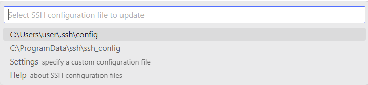
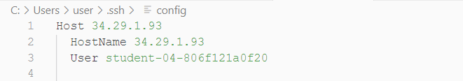

When you sign up for a Google course, be it Google Cloud Skill Boost or Coursera, the assignment requires you to code in the Linux virtual machine created for you once you start the lab, namely Qwiklabs. Since its using Linux, they just provide you with a terminal where you can type command line and even edit code. While this helps you practice on a common, real-world situation, some of you, even me, get tired of it. Here's how you can connect VSCode to an SSH instance so you can code with VSCode while also using the terminal connected to the virtual machine.

> Please note that this steps below only works on some assignment that provide the ssh identity file such as .ppk or .pem and the provided virtual machine allows us to make ssh connection from public network. However, if you know how to work around this problem, these steps will still help you.

## Setting Up Windows

If you're using Windows, make sure the OpenSSH Client is installed. You can check wheter it's installed or not by __Opening Windows Settings__ > __Apps__ > __Apps and Features__ > __Optional Features__. Under the __Installed Feature__ check the list if there is __OpenSSH Client__. If it's not there, you can install it by clicking the __Install Feature__ at the top and type "OpenSSH Client", then install.

## Setting Up VSCode

Of course, the first step is to get VSCode installed. Then __open the extensions panel__, look for [Remote - SSH](https://marketplace.visualstudio.com/items?itemName=ms-vscode-remote.remote-ssh) extension provided by Microsoft, and install it.

## Connecting to Host

### Adding new Host

Once the extension is installed, connect to a new host by opening the __command pallete__ (<kbd>Ctrl</kbd> + <kbd>Shift</kbd> + <kbd>P</kbd>), then type in __connect to a new host__, make sure the "Remote-SSH: Connect to Host..." option was selected, and hit enter.

After that another option appears. __Select the Add New SSH Host...__ option.

Then type in your username followed by "@" and your host. Just like what you would do when connecting to a SSH instance. For example I have the following username and host.

Back to VSCode, type in your username followed by "@" and your external IP address. After that hit enter.

VSCode then ask you to select the configuration file. Just select the first one or just hit enter.

A new notification is appear at the bottom right of your screen indicationg the host was succesfully added.

### Configuring New Host

However, you can't connect to ssh yet, because ssh need you to provide some authentication key. Therefore, __click the Open Config button__ to open the ssh configuration file. If by chance this message did not appear, you can open the command pallete and type `ssh config`, hit enter and then hit enter again to select the default ssh configuration file we want to open. The configuration file will look something like this.

This is where we need the .pem file. From your qwiklabs page, download your authentication file, the one with the _.pem_ format. Save it, put the file wherever you want as long as you know the full path of the authentication file. For example if I put it in the downloads folder the path will look something like this: `C:\Users\user\Downloads\qwiklabs-L46786410.pem`.

> If you use Windows, you can right click on the file, select properties, go to security tab. At the top you can copy the full path of the file.

Add this full path of the authentication file to the ssh config file. So, back to VSCode, under the `User` line, type in `IdentityFile` followed by space and your full path of the authentication file. Save it.

## Connecting to SSH Instance

With that done, you can now connect to the ssh instance by opening a __command pallete__ once more and type __connect to host__, and select the first option just like before. Now you can see your new added host (the IP address of your ssh instance). 

Select the first one and new VSCode window will appear, setting up the SSH host. Select the operating system based on your assignment, in my case it's linux.

If it asks you to connect, just hit enter again to select _continue_

Congratulations. You are now connected to your Virtual Machine using SSH via VSCode.

## Using the Connected Host

To actually using it, open the Explorer tab in VScode > select Open Folder

New popup will appear. By default the value is `/home/student-username/`. If so, just click __OK__.

You now ready to do your assignment. You can open the terminal by pressing <kbd>Ctrl</kbd> + <kbd>`</kbd>. Or just open command pallete and search for terminal. Make sure the connected terminal is your linux virtual machine terminal, usually the line starts with your student-username.

### Notes On Doing The Assignment

If the assigment instruction tells you to type terminal/bash command such `chomd` or `./some_script.py`, type that in the terminal. If the instruction tells you to create or opening a file using nano or vim, you can right click on the folder in the explorer tab of the VSCode and select __new file__ for create a new file, or simply __double click__ the file if it already there. And now since you're in VSCode, you can use the advantage of VSCode such as intellisense for detecting wrong syntax, typos, and some other thing. Just install the corresponding extension based on the what programming language the assignment told you to use.

Simply install by clicking _Install in SSH: ..._.

Good luck on the assignment. No more nano or vim 😁

---

> If you think there is something wrong with this post, please comment down below or submit [a pull request on GitHub](https://github.com/zeerafle/zeerafle.github.io). You can find this post under the _posts directory.