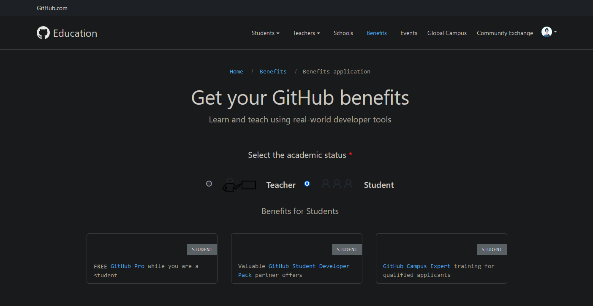
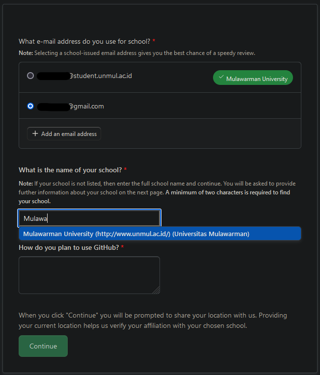
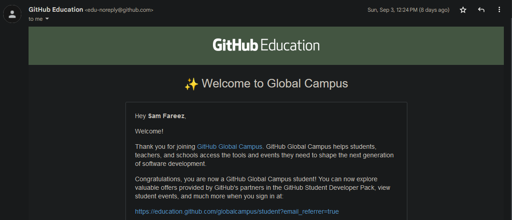
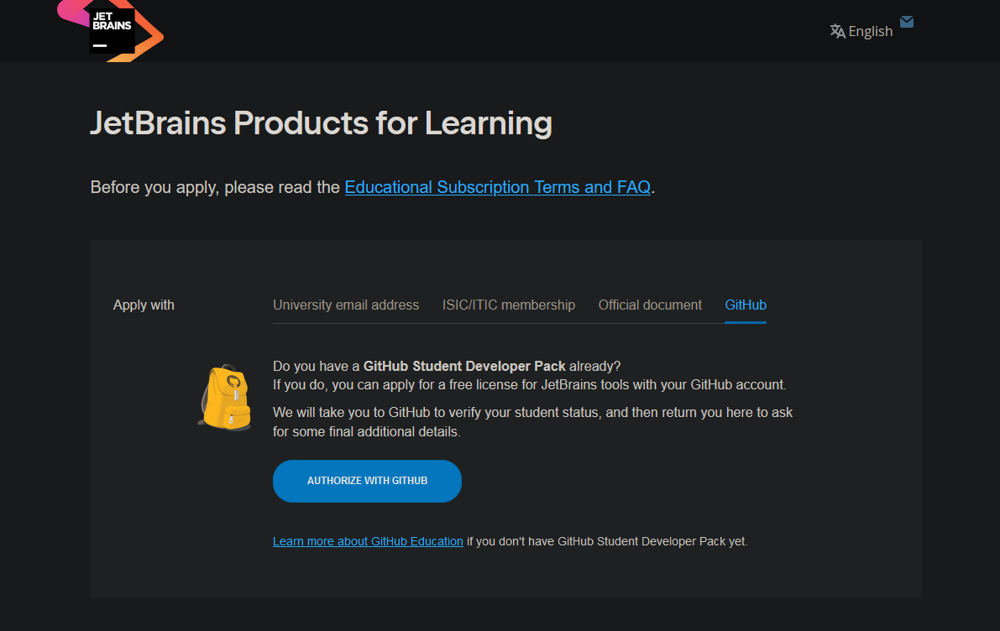
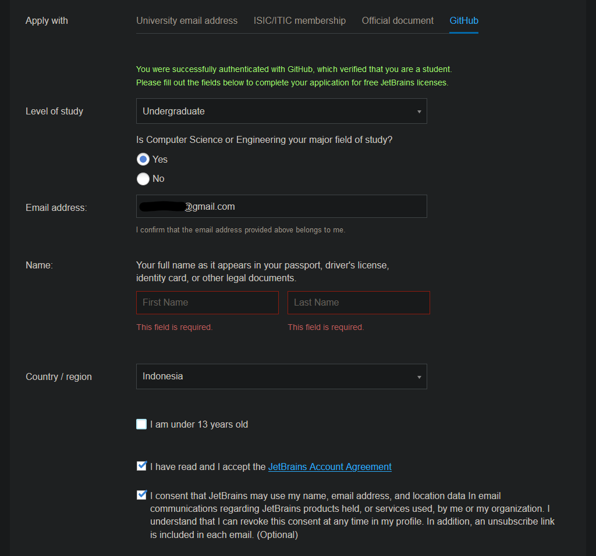
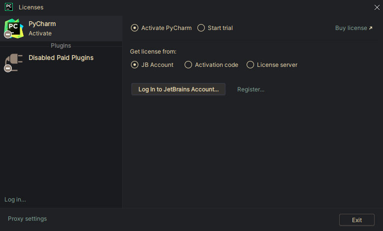
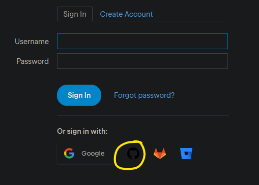
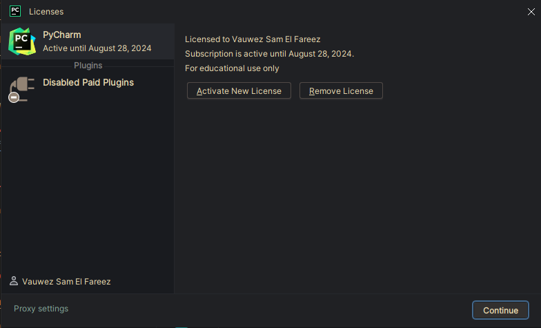

PyCharm Professional memungkinkan kita untuk membuka, membuat, dan mengedit file jupyter notebook (.ipynb). PyCharm Professional bisa didapat gratis untuk pelajar yang mendaftar GitHub Education. Benefit GitHub Education gak cuma PyCharm Professional aja. Ada banyak service atau aplikasi yang kalau daftar reguler itu bayar, tapi dengan GitHub Education jadi gratis digunakan selama menjadi pelajar/mahasiswa.

Tiga hal yang perlu disiapkan:

1. Email pribadi (lebih bagus kalau punya email yang diberikan universitas, misal `elonmusk@student.unmul.ac.id`)
2. Surat resmi yang menandakan bahwa kamu mahasiswa aktif (bisa pakai surat keterangan aktif atau transkrip nilai, bisa bikin di [e-surat](https://e-surat.ft.unmul.ac.id))
3. Akun GitHub, kalau belum punya silahkan [daftar dulu](https://https://github.com/signup)

## 1: Daftar GitHub Education

Klik [link berikut](https://education.github.com/discount_requests/application). Kemudian Sign In dengan akun GitHub mu. Setelah Sign In muncul halaman berikut.

Scroll ke bawah sampai ketemu form berikut.

- Email yang digunakan untuk daftar GitHub akan otomatis terpilih. Klik "Add an email address" kalau ada email universitas.
- Isikan "Mulawarman University" untuk form "*What is the name of your school?*".
- Isikan motivasi untuk menggunakan GitHub di form "*How do you plan to use GitHub?*". Misal (tapi jangan copas).

    > I will use GitHub to share my project and learn from others

Kemudian klik **Continue**. Disini akan diminta bukti status akademik. Upload hasil scan transkrip/surat keterangan aktif kamu. Untuk "Proof Type" pilih sesuai yang kamu upload.

Klik **Process my Application**. Selesai. Tunggu beberapa hari, nanti akan dibalas lewat email.

## 2: Dapatkan JetBrains Professional Desktop

Jika application diterima akan ada email dari GitHub Education.

Ada banyak benefit yang bisa [dieksplor disini](https://education.github.com/pack/offers). Scroll ke bawah sampai ketemu "JetBrains". Klik "[Get access by connecting your GitHub account on JetBrains >](https://www.jetbrains.com/student/?authMethod=github)".

Masuk ke halaman jetbrains, scroll kebawah sampai ketemu **Apply Now**, kemudian klik. Setelah itu akan dibawa ke halaman berikut. Pada tab "*Apply with*" pilih yang GitHub.

Klik **Authorized with GitHub**. Kemudian isikan form seperti gambar berikut.

.

- Level of Study pilih yang Undergraduate
- Is Computer Science ..., pilih yes.
- Email isikan email pribadi yang dipakai juga di GitHub tadi.
- Name isikan nama kamu.
- Country Indonesia
- Klik di 2 kotak centang dibawah

Selanjutnya klik **Apply for Free Products**. Proses application JetBrains berhasil. Silahkan download [PyCharm Professional](https://www.jetbrains.com/pycharm/download/?section=windows).

## 3: Setup PyCharm Professional

Install PyCharm Professional dan buka. Saat pertama kali buka PyCharm akan muncul window berikut.

Klik **Log in to JetBrains Account**. Kemudian akan diarahkan ke browser.

Pilih logo GitHub untuk login dengan GitHub. Ikuti langkahnya, jika "*Authorization Succesful*", kembali ke window PyCharm tadi, klik **Activate**, kemudian Continue, dan TADA!!. Selamat kamu bisa menggunakan PyCharm Professional gratis.

Happy Coding!!
